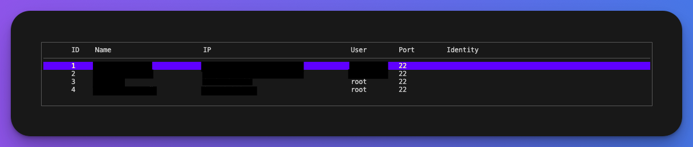

# SSH Manager

SSH Manager is a simple command-line tool written in Go for managing and connecting to remote servers using SSH. It reads and parses your SSH config file, lists available servers, and allows you to select a server to SSH into quickly and easily.

Available for: Linux && MacOS

## Features

- Parse SSH config file (`~/.ssh/config`)
- Display a list of SSH configurations in a table format
- Filter server entries by search term
- Select a server by ID and connect via SSH
- Handle default SSH parameters like port (`22`) and identity file

## Requirements

- Go 1.16 or later
- An SSH config file located at `~/.ssh/config`
- SSH client installed (usually pre-installed on most systems)

## Installation

### 1. Clone the repository or download the binary
To get started with SSH Manager, you can either download the precompiled binary or clone this repository and build the application.

#### Option 1: Clone the repository and build it

```bash
git clone https://github.com/yourusername/ssh-manager.git
cd ssh-manager
go build -o sshm .
sudo mv sshm /usr/local/bin/sshm
```

#### Option 2: Download the binary
```bash
sudo mv ~/Downloads/sshm /usr/local/bin/sshm
```
For macOS users, if you moved the binary in bin,
but you can't use `sshm` because of permissions or because of Gatekeeper(can't be verified by Apple)
```bash
sudo chmod +x sshm
xattr -d com.apple.quarantine sshm
```

## Usage

### 1. Listing SSH configurations
To list all saved SSH configurations in a table format:
```bash
sshm
```

If you want to filter the list by a search term (for example, search for a specific server by name):
```bash
sshm <search_term>
```

### 2. Connecting to a server
After listing the available SSH configurations, you will be prompted to select a server by its ID.



## Roadmap
- Cache configuration list
- Run a command to multiple servers simultaneously
- Generate a small table displaying the server status, including storage, load, CPU, and RAM usage.
- Make servers to be selectable by arrows
- I’m considering a way to share data between multiple devices, but without relying on the cloud.
